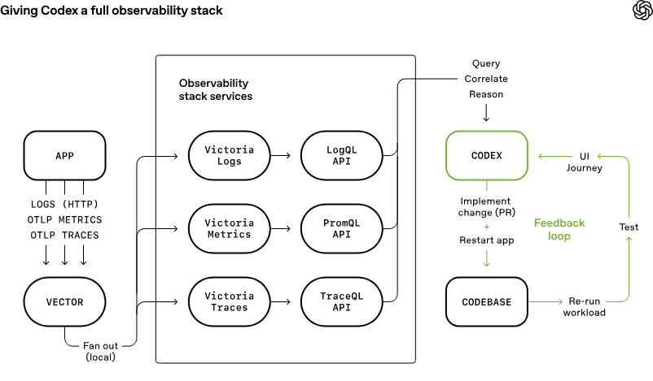

Harness 是指围绕 Agent 构建的测试、验证与约束基础设施，这里的 Harness 至少包括四个部分：验收基线、执行边界、反馈信号和回退手段。

模型虽然重要，但决定系统能不能稳定运行的，往往是这些外围工程条件。这个判断在代码编写这类高可验证任务上最成立，但在开放式研究、多轮协商这类弱验证任务里，模型上限本身仍然更关键

OpenAI 的 Agent 优先开发实践

3 个工程师 5 个月写了百万行代码，将近 1500 个 PR，是传统开发速度的 10 倍。这个速度背后不是模型有多强，而是几个工程决策做对了：

1  Agent 看不到的内容等于不存在：知识必须存在于代码库本身，外部文档对运行中的 Agent 不可见，AGENTS.md 只保留约 100 行作为索引，细节拆到各 docs 目录按需引用。

    - 索引文件：AGENTS.md  架构文件  specs 
  
2. 约束编码化而非文档化：写在文档里的规范很容易被忽略，编码进 Linter、类型系统或 CI 规则里的约束才具备可执行性，架构分层靠自定义 Linter 机械强制，不靠人工 Review。

  npm run lint  npm run test  hook
3.Agent 端到端自主完成任务：从验证当前状态、复现 Bug、实现修复、驱动应用验证，到开 PR、处理 Review 反馈、自主合并，全链路不需要人介入，查日志、查指标、查追踪都由 Agent 主动完成。

4 .最小化合并阻力：测试偶发失败用重跑处理而不是阻塞进度，在高吞吐环境下等待人工审查的成本往往高于修复小错误的成本。写代码的纪律没有消失，只是从人工 Review 变成了机器执行的约束，一次写进去，到处生效。

